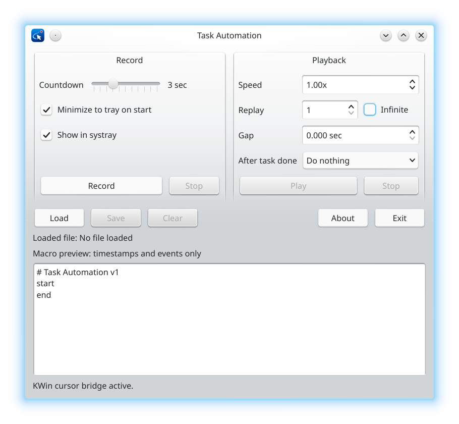

# Task Automation



Task Automation is a KDE Plasma Wayland task recorder and player for Linux. It records keyboard input, mouse clicks, mouse movement, mouse wheel events, and timing into a plain-text `.auto` file, then plays the task back later at the selected speed and replay count.

## Status

This project is an early Linux/KDE Wayland prototype. It is intended for local automation experiments and personal workflows.

The app currently targets:

- Arch Linux
- KDE Plasma Wayland
- Qt 6
- Linux `evdev` and `uinput`
- KWin scripting for accurate cursor-position feedback on Wayland

## Features

- Record mouse movement.
- Record left, right, and middle mouse clicks.
- Record mouse wheel movement.
- Record keyboard press/release events.
- Save recordings as plain-text `.auto` files.
- Load and play `.auto` files.
- Playback speed control.
- Replay count control.
- Infinite replay mode.
- Replay gap in seconds.
- Countdown slider from `0` to `10` seconds before recording starts.
- Option to minimize to tray when recording starts.
- Optional system tray icon.
- Red tray icon while recording.
- Click the red tray icon to stop recording and show the main window again.
- Hide the main window during playback and show it again when playback finishes.
- Clear the current recording/log.
- About dialog.
- Optional action after playback finishes:
  - Do nothing
  - Exit
  - Log out
  - Hibernate
  - Reboot
  - Shutdown

## Macro file format

Task Automation files use the `.auto` extension.

Macro files are intentionally clean. They contain only timestamps and recorded events. Playback settings such as speed, replay count, replay gap, countdown, tray visibility, and after-task action are app settings. They are not saved inside macro files.

Example:

```text
# Task Automation v1
start
t=0.000000 mouse_pos x=500 y=400
t=0.250000 button code=272 name=BTN_LEFT value=1
t=0.330000 button code=272 name=BTN_LEFT value=0
t=1.100000 wheel dy=-1 hi_res=0
end
```

## Requirements

On Arch Linux:

```bash
sudo pacman -S --needed base-devel cmake qt6-base kpackage kconfig
```

Task Automation uses:

- Qt 6 Widgets for the graphical interface.
- Linux `evdev` for reading input events.
- Linux `uinput` for playback through a virtual input device.
- KDE/KWin scripting for Wayland cursor-position feedback.

## Installation

For Archlinux KDE Plasma Wayland users:

```bash
yay -S task-automation
```

## Build from source

```bash
git clone https://github.com/yousefvand/Task-Automation.git
cd Task-Automation
./build-arch.sh
./build/taskautomation
```

## Input permissions

Recording needs read access to `/dev/input/event*`.
Playback needs write access to `/dev/uinput`.

For local development, install the included udev rule once:

```bash
./install-udev-dev-rule.sh
```

Then log out and log back in, or reboot.

After that, run the app as your normal desktop user:

```bash
./build/taskautomation
```

Do not run the GUI with plain `sudo` on KDE Wayland if you want the KWin cursor bridge to work correctly.

## KDE Wayland cursor accuracy

For accurate cursor playback, the bottom status line should show:

```text
KWin cursor bridge active.
```

If the bridge is inactive, the app falls back to raw relative mouse movement. The fallback can work for simple tasks, but it can drift because Wayland, KWin, and libinput pointer acceleration can transform relative pointer movement.

After launching the app, move the mouse once. The bridge should become active automatically.

Useful diagnostic command:

```bash
journalctl --user -u plasma-kwin_wayland.service -f
```

Look for messages containing:

```text
TaskAutomationCursorBridge
```

## Recommended workflow

1. Enable **Minimize to tray on start**.
2. Enable **Show in systray**.
3. Choose the countdown delay.
4. Click **Record**.
5. Perform the task.
6. Click the red tray icon to stop recording.
7. Save the task as a `.auto` file.
8. Click **Play** to test it.

## Security note

This application reads keyboard and mouse input and can replay keyboard/mouse actions through a virtual input device. Only run it from source you trust.

The included development udev rule gives members of the `input` group access to input devices. That is convenient for development, but it is a powerful permission.

